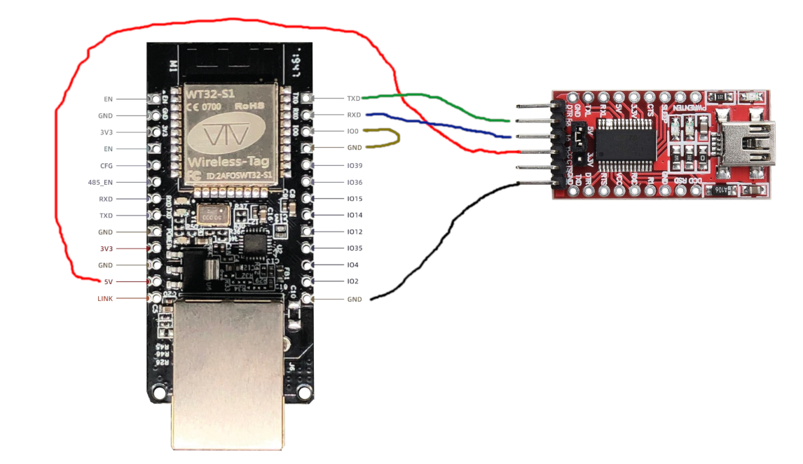
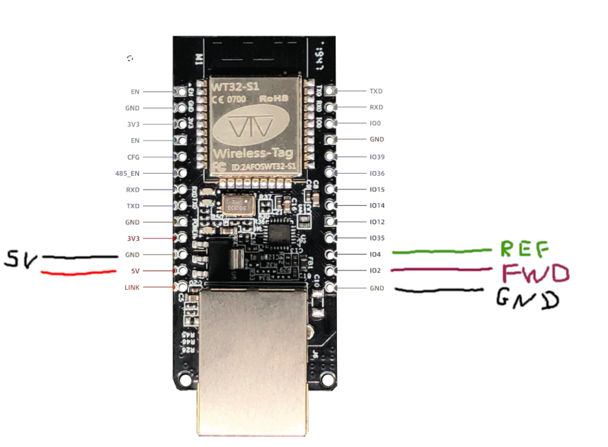
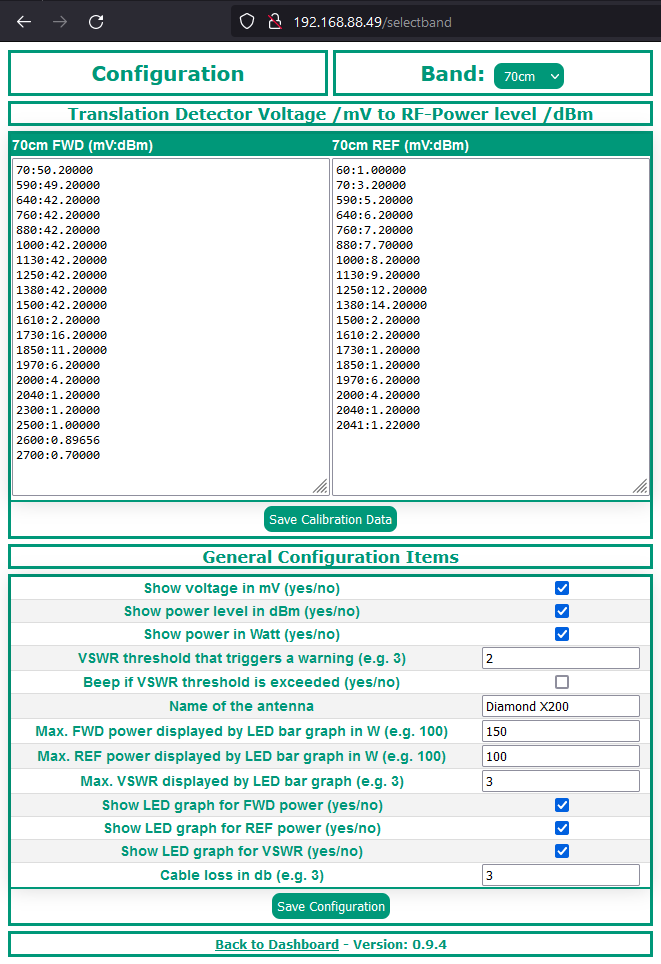

# Remote Power/SWR Meter

This repository is a fork of DK1MI's original project, maintained by DL3HC. Original authorship and credit for the initial design remain with DK1MI.

This WT32/ESP32-based project, combined with a directional coupler setup, allows you to remotely monitor the output power and SWR of your station via a web browser.

To achieve this, it reads two voltages supplied by the directional couplers. From these, the respective power is calculated with the help of a calibration table created by the user.

Special thanks to Matthias DD1US for support with the directional coupler setup, software testing, and ideas for additional features.

## Changelog

## v1.0.3

- Fixed two compile-breaking bugs introduced by a prior commit, where a stray brace split
  `millivolt_to_dbm()` and `handleDATA()` and orphaned code at file scope
- Replaced the calibration lookup with a compact sorted point table instead of a dense
  3300-entry array
  - Cuts RAM usage by more than 90%
  - Fixes a division-by-zero/NaN bug when a reading fell outside the calibrated range
- Reduced power/SWR reading jitter
  - Added smoothing (EMA) across polls and decorrelated ADC samples
  - Sanitized NaN/Inf values in all displayed fields, not just Return Loss
- Fixed a frontend bug where the LED bar graphs snapped to new values instead of animating
  smoothly
- Fixed a bug where saving the general configuration could send two HTTP responses for one
  request
- Reduced how often the temperature sensor blocks the web server (once every 5 seconds
  instead of on every single page refresh)
- Added safeguards against accidental data loss
  - Calibration/configuration/band-selection endpoints now require a proper form submission
    (a stray GET request, e.g. from a browser or crawler, can no longer wipe saved data)
  - Invalid band names are now rejected instead of silently creating a new empty configuration
- A failure to mount the internal filesystem no longer prevents the web server from starting
- Added mDNS support: the device can be reached at `http://<hostname>.local` (hostname is
  configurable in the code)
- Added OTA (over-the-air) firmware updates over the network
  - Protected by a password; on first use you are required to replace the default password
    before the device becomes usable
  - Updating via USB always remains available as a fallback (see `HOWTO.md`)
- Added a watchdog timer that automatically reboots the device if it becomes unresponsive
- Modernized the web dashboard and configuration page with a new dark, instrument-panel-style
  visual design
- Modernized the JavaScript code (network requests, LED bar graph rendering)
- Added `HOWTO.md` with setup, OTA, and recovery instructions

## v1.0.2

- Added rudimentary PEP implementation for testing
  - Can be enabled or disabled via the config page
- Added temperature reading
  - Requires a DS18B20 sensor on pin IO14
  - Temperature display can be enabled or disabled via the config page
  - Display in Celsius or Fahrenheit can be toggled via the config page
  - Requires the installation of the following libraries:
    - OneWire
    - DallasTemperature

## Prerequisites

### Hardware

The following hardware is required for this project:

- WT32-ETH01 development board
- USB-to-serial adapter (FTDI)
- Directional coupler setup that outputs one voltage between 0 and 3.3 V each for forward and reflected power
- (Optional) DS18B20 temperature sensor, connected to pin IO14, if you want temperature readout

Matthias DD1US uses the following components in his implementations, among others:

- Ericsson coupler + AD8318 detector
- Narda coupler + AD8313 detector

My own implementation uses the directional coupler from an old SWR/power meter.

The wiring was done according to the picture shown further below.

### Software / Libraries

- Arduino IDE (2.x recommended)
- Project code: https://github.com/dl3hc/wt32_powermeter
- Libraries that need to be installed manually:
  - WebServer_WT32_ETH01: https://github.com/dl3hc/WebServer_WT32_ETH01-fork
  - DallasTemperature
  - OneWire
- Libraries that ship with the ESP32 Arduino core (no separate install needed):
  - `ESPmDNS` -- used for `http://<hostname>.local` network discovery
  - `ArduinoOTA` -- used for over-the-air firmware updates
  - `esp_task_wdt` -- used for the watchdog timer

  The sketch compiles on both the classic ESP32 Arduino core (2.x) and the IDF5-based core
  (3.x). `ETH.begin()` and the watchdog init call are written to work on either -- the latter
  is version-guarded in `setup()` since core 3.x replaced the old `(timeout_seconds, panic)`
  signature with a config struct.

  Note: the `WebServer_WT32_ETH01` library only builds on core 3.x with the fix in the fork
  linked above (upstream's `#if ESP32` check evaluates to false against core 3.x's
  `-DESP32=ESP32` define; the fork uses `#if defined(ESP32)` instead).

## Downloading and Setting Up the Arduino IDE

The following steps are required to compile and upload the code to the board:

1. Download and install Arduino IDE 2.1:  
   https://wiki-content.arduino.cc/en/software

2. Follow this guide to install the ESP32 board definitions:  
   https://randomnerdtutorials.com/installing-esp32-arduino-ide-2-0/

3. Select the correct board in the Arduino IDE:  
   **Tools → Board → esp32 → ESP32 Dev Module**

4. Install the required libraries:  
   **Tools → Manage Libraries →** search for and install **WebServer_WT32_ETH01**,
   **DallasTemperature**, and **OneWire** (see [Prerequisites](#prerequisites) above)

## Downloading the Software

1. Download the code from the repository:  
   `git clone https://github.com/dl3hc/wt32_powermeter`

2. Open the file `wt32_powermeter.ino` in the Arduino IDE, or start it by double-clicking it.

---

## Programming the Board

1. Connect the board to a USB-to-serial adapter as shown in the picture below.



2. Select the correct COM port in the Arduino IDE:  
   **Tools → Port → Select Port**

3. Click **Upload** (top left, arrow pointing to the right).

This is the only way to get firmware onto a completely fresh board, and it always remains
available afterward as a fallback -- USB upload talks directly to the ESP32's bootloader and
does not depend on the network, OTA password, or any other part of the running application.
See `HOWTO.md` for recovery instructions if the device becomes unreachable on the network or
you forget the OTA password.

---

## Connecting the Board to the Directional Coupler

The two pins **IO0** and **GND** only need to be bridged during programming. Remove the bridge again after programming.



---

## Configuration

The following code blocks in `wt32_powermeter.ino` can be adapted to your needs before flashing.

### Network Configuration

```cpp
IPAddress myIP(192, 168, 2, 198);
IPAddress myGW(192, 168, 2, 1);
IPAddress mySN(255, 255, 255, 0);
IPAddress myDNS(192, 168, 2, 1);
```

```cpp
ETH.begin(ETH_PHY_ADDR, ETH_PHY_POWER);
ETH.config(myIP, myGW, mySN, myDNS);
WT32_ETH01_waitForConnect();
```

By default the device uses the **static IP `192.168.2.198`** defined above -- `ETH.config(...)` is
called unconditionally, so a static IP is always active out of the box. Adjust `myIP`/`myGW`/`mySN`/`myDNS`
to match your network before flashing, or comment out the `ETH.config(myIP, myGW, mySN, myDNS);`
line entirely if you'd rather obtain an address via DHCP instead.

### mDNS Hostname

```cpp
String device_hostname = "powermeter";
```

Regardless of which IP the device ends up with, it's also reachable at `http://powermeter.local`
via mDNS. Change `device_hostname` if you're running more than one unit on the same network, or
prefer a different name -- this same name is also used to identify the device for OTA updates.

---

## Selectable Bands

To add or remove bands, adjust the following code block:

```cpp
String band = "";
String default_band = "70cm";
String band_fwd = band + "_fwd";
String band_ref = band + "_ref";
String band_list[] = { "1.25cm", "3cm", "6cm", "9cm", "13cm", "23cm", "70cm", "2m", "HF" };
```

* Extend or shorten `band_list[]` as needed
* Set `default_band` to the desired default band

---

## Accessing the Web Interface

Open one of the following addresses in your preferred browser:

```text
http://YOUR_IP_ADDRESS
```
```text
http://powermeter.local
```

Example, using the default static IP:

```text
http://192.168.2.198
```

The IP address is either the one defined in the code (default) or one assigned dynamically via
DHCP if you switched to that mode. If DHCP is used, you can find the assigned address in your
router's dashboard under connected devices, or just use the `.local` address instead.

### First-time setup: OTA password

The very first page you'll see is **not** the dashboard -- every unit ships with the same
default OTA (over-the-air update) password, and the device refuses to serve the normal
dashboard/config pages until you replace it with one of your own. Set a password (8+ characters)
and submit the form; this only needs to be done once and takes effect immediately. See
`HOWTO.md` for full details, including how to recover if you forget it.

---

## Usage

Once the OTA password has been set, the dashboard is shown by default. To configure the
connected directional couplers, click **Configuration** in the footer of the page.



---

## Calibration Data

First, select the band you want to configure using the dropdown menu labeled **Band** in the top right.

The actual calibration values shown here are not important; they were used only for debugging purposes. For your own setup, you need to determine suitable values. Enter the `mV:dBm` value pairs for **FWD** and **REF** here, then click **Save Calibration Data**.

You can enter the values in any order; manual sorting is not necessary -- they're sorted automatically after saving and displayed correctly.

### How the calibration was performed in my setup

1. The components were connected as follows:
   **IC-7300 → Remote Power Meter → known-good power meter → dummy load**

2. Set the band to **20m** and the mode to **FM**.

3. Set the power to **1 W**, pressed PTT, noted the measured power shown by the reference power meter and the voltage measured by the Remote Power Meter. These values were used for the **FWD** calibration table.

4. Repeated the previous step until maximum power was reached.

5. Then the Remote Power Meter was removed from the chain, turned around, and inserted again.

6. Measured again at **1 W**, pressed PTT, noted power and voltage. These values were used for the **REF** calibration table.

7. The dBm values for each entry were calculated from the notes and each line was replaced with the format
   `voltage:dBm`

8. Both tables were then pasted into the Remote Power Meter configuration page.

---

## General Configuration Options

The following general configuration parameters are available to customize the application:

* **Show voltage in mV (yes/no):**
  Displays the measured voltage in millivolts or hides it.

* **Show power level in dBm (yes/no):**
  Displays the power level in dBm or hides it.

* **Show power in watts (yes/no):**
  Displays the power in watts or hides it.

* **VSWR threshold that triggers a warning (e.g. 3):**
  Any calculated value above the configured threshold triggers a visual and optionally audible warning.

* **Beep if VSWR threshold is exceeded (yes/no):**
  Emits a beep when the threshold configured above is exceeded. This only works in some browsers.

* **Name of the antenna:**
  Freely definable name of the antenna for this band.

* **Max. FWD power displayed by LED bar graph in W (e.g. 100):**
  Sets the upper limit for the FWD power display in the LED bar graph.

* **Max. REF power displayed by LED bar graph in W (e.g. 100):**
  Sets the upper limit for the REF power display in the LED bar graph.

* **Max. VSWR displayed by LED bar graph (e.g. 3):**
  Sets the upper limit for the VSWR LED bar graph.

* **Show LED graph for FWD power (yes/no):**
  Enables or disables the LED/VU-meter-style display for forward power.

* **Show LED graph for REF power (yes/no):**
  Enables or disables the LED/VU-meter-style display for reflected power.

* **Show LED graph for VSWR (yes/no):**
  Enables or disables the LED/VU-meter-style display for VSWR.

* **Cable loss in dB (e.g. 3):**
  Sets the cable loss of your system, which is then taken into account in the calculations.

* **Display average power instead of PEP (yes/no):**
  Toggles between averaging the 50 ADC samples taken per reading, or using their peak value
  (PEP-like behavior).

* **Show temperature (yes/no):**
  Enables or disables the temperature readout (requires a DS18B20 sensor on IO14).

* **Display temperature in Celsius or Fahrenheit:**
  Toggles the unit used for the temperature readout.

After making the desired changes, click **Save Configuration**.

---

## Updating Firmware Over the Network (OTA)

Once the OTA password has been set (see [First-time setup](#first-time-setup-ota-password) above):

1. In the Arduino IDE, go to **Tools → Port** -- the device should appear under "Network Ports"
   as `<hostname> at <ip>` (e.g. `powermeter at 192.168.2.198`).
2. Select it, then **Upload** as normal. You'll be prompted for the OTA password.

USB upload (see [Programming the Board](#programming-the-board) above) always remains available
as a fallback, independent of the network or OTA password -- see `HOWTO.md` for full setup,
update, and recovery instructions, including how to reset a forgotten OTA password.

---

## Reliability

- A hardware watchdog automatically reboots the device if the main loop ever hangs, instead of
  leaving it silently unresponsive.
- A failure to mount the internal filesystem (used for calibration data) no longer prevents the
  dashboard, network, or OTA from starting -- calibration features degrade gracefully instead.

---

## Warning / Disclaimer

This software has minimal security mechanisms. The dashboard and configuration pages
(calibration data, general settings, band selection) have **no authentication** -- any device on
the same network can view and change them, though state-changing requests must at least be a
proper form submission (accidental GET requests can no longer silently wipe your settings).
Over-the-air firmware updates require a password that you must set on first use, but the default
password is public (it's in this repository's source code), so make sure you actually change it.

**Do not make the application publicly accessible. Do not expose it to the internet.**

If you are unhappy with the current state of the software, you are welcome to contribute, submit improvements, and open pull requests.

---

## Tags
`#Arduino #ESP32 #HamRadio #Remote`
